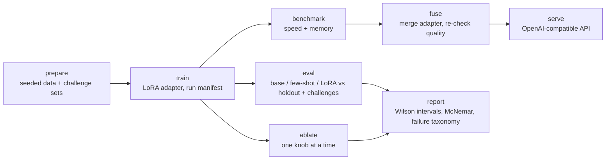

# Fine-tuning and honestly evaluating a local LLM with Apple MLX

A hands-on tutorial: train a LoRA adapter for Qwen2.5 on your Mac so it turns operational requests into strict JSON tool calls, then measure whether it actually worked.

> *"Ship v2.3.1 of auth-api into prod with 3 instances."*
> → `{"tool":"deploy_service","parameters":{"service":"auth-api","version":"v2.3.1","environment":"production","replicas":3,"notify_channels":[]}}`

The training loop is the easy part. This repo is mostly about the questions to ask of *any* fine-tune:

| Question | Where it's answered |
|---|---|
| What exactly is the model trained on? | `main.py show-mask` (which tokens the loss scores) |
| Is fine-tuning even necessary? | zero-shot and **few-shot baselines** in every evaluation |
| How big is the change? | `main.py show-params` (LoRA parameter accounting) |
| Did it learn, or memorize? | loss curves, plus **challenge sets** with unseen entities, omitted defaults, and new kinds of unsupported requests |
| Is the improvement real, or noise? | **95% confidence intervals** and **paired McNemar tests** |
| What does it still get wrong? | failure categories, per-field accuracy, example failures |
| What do the knobs do? | `main.py ablate` (one hyperparameter at a time) |
| What is the training loop actually doing? | `main.py toy-train` (the same loop by hand, no downloads, ~1 s) |

Repository: [theRealMarkCastillo/mlx-model-training-evals](https://github.com/theRealMarkCastillo/mlx-model-training-evals).

Theory behind every number printed here, one page per concept: [`docs/concepts.md`](docs/concepts.md).



## Quickstart

Apple Silicon Mac, Python 3.12+, [uv](https://docs.astral.sh/uv/):

```bash
uv sync --locked
uv run python main.py toy-train                  # optional first step: the loop in miniature, no downloads
uv run python main.py prepare                    # generate data (deterministic)
uv run python main.py show-mask                  # see what training scores
uv run python main.py train --preset 3b          # ~20 min on an M2 Max
uv run python main.py eval --preset 3b --challenge
```

Or follow the guided notebook, which runs the same code with explanations at each step:

```bash
uv run python main.py notebook
```

The model downloads on first use (3B ≈ 2 GB). Before trying a larger preset, run a short job (`train --preset 14b --iters 10`) and check the peak-memory line.

## Reference results (Qwen2.5-3B, M2 Max)

One complete run on an M2 Max (96 GB), default settings: 200 iterations, batch 4, rank 8, seed 42. Training took about 19 minutes, peaked at 15.9 GB Metal memory, and trained 6.65M parameters (0.216% of 3.09B). Charts and the full numbers are in [`docs/reference-run/`](docs/reference-run/). Your numbers will differ in the last digits; Metal kernels are not bit-reproducible.

Re-running the same evaluation later with `--constrained` (same adapter, same seed) reproduced the three columns below exactly — a small reproducibility check on top of the intervals.

**Exact match, % [95% interval], greedy decoding:**

| Set | n | Base zero-shot | Base few-shot (5 shots) | LoRA |
|---|---:|---:|---:|---:|
| `test` (new wording) | 75 | 0 [0–5] | 68 [57–77] | **100** [95–100] |
| `challenge_defaults` (all optionals omitted) | 40 | 0 [0–9] | 58 [42–71] | **100** [91–100] |
| `challenge_abstain` (new unsupported kinds) | 40 | 0 [0–9] | **100** [91–100] | 95 [83–99] |
| `challenge_entities` (unseen names) | 40 | 0 [0–9] | 60 [45–74] | 75 [60–86] |

What the run shows:

* **Fine-tuning earned its keep here.** LoRA beats few-shot on the holdout (24 samples only LoRA gets right, 0 the other way; McNemar p ≈ 1e-7). Few-shot is not free either: its prompt is 985 tokens against 666, paid on every request.
* **Zero-shot's 0% is mostly a format result, not a capability one.** 95% of outputs are valid JSON, but the model writes `{"deploy_service": {...}}` or bare parameters instead of the `{"tool": ..., "parameters": ...}` envelope. The system prompt describes that envelope in words and never shows one. I haven't tested a zero-shot prompt that includes an example envelope, and the adapter was trained against this exact prompt, so it stays unchanged; few-shot is the fairer prompted baseline.
* **100% on the holdout overstates what was learned.** On unseen entities LoRA drops to 75%, and all 10 failures are `rollback_deployment`. The model wrote `dep-9821` (the example in the system prompt) or `dep-9148` for a request naming `email-dispatcher-r9148`: it learned the `dep-NNNN` shape rather than copying the identifier from the request. The other three tools score 100% on unseen names. The unseen identifier format is a deliberately large shift, so read this as one specific failure, not as a general 75%.
* **Abstaining generalizes, mostly.** The two LoRA misses answered `missing_required_parameter` for "increase the memory limit of X to 4Gi", a kind of request never seen in training.
* **Validation loss falls from 1.76 to 0.002 by iteration 150**, and the best checkpoint (iteration 149) is not the last. Most of the learning happens in the first 50 iterations, which the ablation below quantifies.
* **Dynamic adapters cost decode speed:** 41 tokens/s against 102 for the base model on this prompt. Fusing the adapter into the weights should recover most of that speed, but this reference run did not measure it: run `benchmark --fuse` to see the speed and the effect of requantization on quality.

**How much of that is the seed?** The table above is seed 42. Repeating the identical setup for two more seeds (`main.py ablate seed 42 --iters 200`, one seed per invocation so an interrupted run costs only that seed, merged by `scripts/merge_seed_sweep.py`) gives:

| Seed | Exact match (test, n=75) | Test loss | Best val loss |
|---:|---:|---:|---:|
| 42 | 100.0% [95–100] | 0.0011 | 0.0023 |
| 43 | 97.3% [91–99] | 0.0010 | **0.0001** |
| 44 | 96.0% [89–99] | 0.0032 | 0.0012 |
| **across seeds** | **97.8% ± 1.7** | | |

Two things follow. The honest headline is **97.8% ± 1.7**, not 100%: the intervals overlap heavily, so the runs agree, and the last digit of any single run means nothing. And seed 43 had the *best* validation loss of the three while scoring *below* seed 42 on exact match — a small, concrete instance of the point the metrics section makes: loss and task accuracy answer different questions. The merged numbers live in [`docs/reference-run/seed_sweep.json`](docs/reference-run/seed_sweep.json).

**Ablation over training iterations** (`main.py ablate iters 25 50 100 200`, one seed, `test` set, n = 75):

| Iterations | Exact match [95%] | Schema valid | Test loss | Main failure |
|---:|---:|---:|---:|---|
| 25 | 27% [18–38] | 36% | 0.134 | invalid JSON/schema (19 + 29 of 75) |
| 50 | 75% [64–83] | 88% | 0.041 | 9 no JSON; 8 wrong tool; weak on `deploy_service` and `no_action` |
| 100 | 61% [50–72] | 100% | 0.036 | 22 wrong tool: answers `no_action` to real restart and scale requests |
| 200 | 100% [95–100] | 100% | 0.001 | none |

The point to take from it: format is learned first (schema validity reaches 100% by iteration 100), correct tool choice and parameters come later, and progress is not monotonic. At iteration 100 the model over-abstains, and its validation loss bumped up (0.039, from 0.015 at iteration 50) at the same time. The 50 and 100 intervals overlap and this is a single seed, so treat the dip as suggestive, not established. The four runs share a seed and follow the same trajectory (their validation losses at iterations 25 and 50 are identical), so this sweep is closer to "checkpoints of one run" than to four independent experiments.


## The task and the data

`src/schema.py` defines five tools as strict Pydantic models: `deploy_service`, `restart_pod`, `rollback_deployment`, `scale_cluster`, and `no_action`. The model should answer `no_action` when no tool fits or a required value is missing, instead of guessing. The system prompt is generated from the models, so instructions and validation can't drift apart.

`src/generate_data.py` builds a seeded, synthetic dataset with two generalization axes controlled separately:

* **Wording.** Each tool has four phrasing families: train uses 0–1, validation 2, test 3.
* **Entities.** Standard splits share one pool of service/pod/region/cluster names; `challenge_entities` uses names never seen in training.

About 30% of requests omit optional values, which must then be written with their documented defaults.

| File | n | Wording | Entities | Purpose |
|---|---:|---|---|---|
| `train.jsonl` | 250 | families 0–1 | seen | training (50 per tool) |
| `valid.jsonl` | 50 | family 2 | seen | validation loss during training |
| `test.jsonl` | 75 | family 3 | seen | holdout (15 per tool) |
| `challenge_entities.jsonl` | 40 | families 0–1 | **unseen** | do new names and values transfer? |
| `challenge_defaults.jsonl` | 40 | family 3 | seen | **every** optional value omitted |
| `challenge_abstain.jsonl` | 40 | all | seen | **kinds** of unsupported request not seen in training |
| `general.jsonl` | 24 | — | — | ordinary requests (arithmetic, facts, rewriting) for the forgetting check, with a plain assistant system prompt |

No prompt appears in more than one file. Each record carries a `meta` field (tool, family, omitted fields) that the evaluator uses to slice results. This is still a synthetic task: good scores here say nothing about messy production traffic.

## Training

```bash
uv run python main.py train --preset 3b
uv run python main.py train --preset 3b --iters 50 --rank 4      # quick overrides
uv run python main.py train --config my_config.yaml              # standalone MLX-LM config
```

LoRA freezes the base weights and learns a low-rank update per adapted projection:

```text
W_effective = W + scale · (B @ A)      A: r × d_in,  B: d_out × r,  B initialised to 0
```

MLX applies `scale` directly; it is not `alpha / r` as in some other libraries. With `mask_prompt: true`, the loss covers only the assistant's answer. In this task that is about 16–30 of ~650 tokens per record (`show-mask` highlights them).

All shared settings live in `config/base.yaml`. A preset changes only what must scale with model size:

| Preset | Model (4-bit) | Batch | LoRA layers | Grad checkpointing |
|---|---|---:|---:|---|
| `3b` | Qwen2.5-3B-Instruct | 4 | 16 | off |
| `7b` | Qwen2.5-7B-Instruct | 2 | 16 | on |
| `14b` | Qwen2.5-14B-Instruct | 1 | 16 | on |
| `32b` | Qwen2.5-32B-Instruct | 1 | 8 | on |
| `72b` | Qwen2.5-72B-Instruct | 1 | 4 | on |

These are starting points, not guaranteed memory fits. Equal `iters` with different batch sizes means different numbers of examples seen. The training summary reports examples seen, epochs, the best validation iteration, LoRA parameter count, and peak Metal memory, and warns if validation loss rises after its minimum. The config is validated by a Pydantic model (`src/config.py`) before anything downloads.

## Evaluation

```bash
uv run python main.py eval --preset 3b                       # test set: base, few-shot, LoRA
uv run python main.py eval --preset 3b --challenge           # plus the three challenge sets
uv run python main.py eval --preset 3b --variants base fewshot   # baselines only, no adapter needed
uv run python main.py eval --preset 3b --variants base --constrained   # base + grammar-constrained decoding
```

| Variant | What it is |
|---|---|
| `base` | base model, system prompt only (zero-shot) |
| `fewshot` | base model plus 5 worked examples from the training split (one per tool) |
| `lora` | base model plus the latest trained adapter |
| `grammar` | base model with **grammar-constrained decoding** (`--constrained`): valid JSON by construction |
| `fused` | adapter merged into weights (`--fused PATH` or `benchmark --fuse`) |

Decoding is greedy, and every variant sees the same records. Metrics:

| Metric | Definition |
|---|---|
| Assistant loss | Token-weighted cross-entropy on the reference answer, with the training mask |
| Pure JSON | The whole response is one JSON object, with no prose or fences |
| Schema valid | Recovered JSON satisfies the matching tool's strict schema |
| Tool accuracy | Correct tool name |
| **Exact match** | Pure JSON, schema valid, and identical to the reference, including defaults and types |
| Normalized match | Equal after filling omitted defaults (weaker; reported separately) |

Each rate has a **95% Wilson interval**. With 15 samples per tool, a measured 80% is compatible with anything from about 55% to 93%. The report also includes:

* **Paired comparisons:** McNemar's exact test of the reference variant (LoRA when present, otherwise the last variant) against each other variant on the same samples, for both exact match and schema validity. Only discordant samples (one right, one wrong) count as evidence.
* **Failure categories:** `json`, `schema`, `format` (wrapped in prose), `tool`, `omitted_default` (correct values but a default left out), `parameters`.
* **Per-tool and per-field accuracy**, and slices with and without omitted values.
* **Example failures**, with the wrong fields listed.

### The constrained-decoding comparison

`--constrained` adds the `grammar` variant: the same base model, decoded under a JSON grammar derived from the tool schemas (`src/constrained.py`). Every step masks tokens that would leave the language of schema-valid calls, so prose, markdown fences, and the wrong envelope are impossible — **without any training**.

This separates formatting failures from task failures. On the 3B reference preset (full sets, greedy, seed 42), adding the grammar to the **base** model produces:

| Set | Metric | Base | **Base + grammar** | Few-shot | LoRA |
|---|---|---:|---:|---:|---:|
| `test` (n=75) | schema valid | 0% | **100%** | 85% | 100% |
| `test` (n=75) | tool accuracy | 0% | 89% | 92% | 100% |
| `test` (n=75) | exact match | 0% | 43% [32–54] | 68% [57–77] | 100% [95–100] |
| `challenge_abstain` (n=40) | exact match | 0% | **100%** | 100% | 95% |
| `challenge_defaults` (n=40) | exact match | 0% | 42% | 58% | 100% |
| `challenge_entities` (n=40) | exact match | 0% | 40% | 60% | 75% |

What it shows:

* **Grammar-constrained decoding matches LoRA's schema validity exactly** on the holdout — 75 of 75 samples valid for both, no discordant pair (McNemar p = 1.0) — and lifts the base model from 0% to 89% tool accuracy and 43% exact match, with no training at all.
* What remains is squarely task error: the grammar variant's holdout failures are 8 wrong tools, 11 omitted defaults and 24 wrong parameter values. It never fails on format.
* On `challenge_abstain` it is the **best** variant (100%, against LoRA's 95%): once the envelope is guaranteed, the base model abstains correctly on kinds of request it never saw in training. LoRA's two misses there are parameter/format slips, not failures to abstain.
* The two fixes are complementary — grammar buys the contract, training buys the decisions — and few-shot prompting sits between them (68% exact match) at 985 prompt tokens per request against 666. (That sentence is about the 3B model; the next section shows it needs a size qualifier.)

The 0.5B smoke test this section used to quote (`base` 0/8 schema-valid vs `grammar` 8/8, paired p = 0.008) showed the same mechanism more cheaply; the 3B numbers above are the ones to cite.

`--samples N` takes a tool-balanced subset. Use the full sets for any comparison you intend to report. Every sample's prompt, output, parse result, verdicts, token counts, and timings are saved in `eval_results.json`.

Loss and exact match answer different questions. Loss measures how much probability the model puts on the reference answer; exact match judges one greedy output, all or nothing. Use loss to watch training and task metrics to decide.

### Sampling instead of greedy decoding

`--temperature T` (with `--seed`) samples instead of decoding greedily. The metrics and the paired tests still apply, but each variant becomes one stochastic draw rather than the model's single most likely output, which is the point: format validity usually gets *worse* and less predictable when you sample, and that is a cost of deployment worth measuring. The seed is recorded and re-applied per variant, so the run is reproducible.

```bash
uv run python main.py eval --preset 3b --temperature 0.7 --seed 7
uv run python main.py eval --preset 3b --temperature 0.7 --seed 7 --repeats 5   # plus pass@k
```

`--repeats k` draws k samples per record and adds a **pass@k** table: the first draw's rate (what the flat metrics report), every draw's rate, the fraction of records that *any* draw got right, and how many records no draw got. That is how you price sampling honestly — retrying recovers part of what one draw loses, and the never-right residue is what more attempts will not fix. With `--temperature 0` the same command measures run-to-run flakiness instead of sampling, which is a useful sanity check of the Metal non-determinism the reproducibility notes mention.

### Did fine-tuning hurt anything else?

Every other metric here measures the task. `main.py forgetting` measures the *cost* of the task: it scores the base model and the trained adapter on 24 ordinary requests (`data/general.jsonl` — arithmetic, facts, rewriting, sentiment) using assistant loss, with their own plain assistant system prompt rather than the ops one. That prompt switch is what makes drift visible: an adapter that has overfit the tool contract tends to answer arithmetic with JSON, and its loss on the ordinary answer rises.

```bash
uv run python main.py forgetting --preset 3b
```

The comparison is paired per record and tested with an exact **sign test** (not a difference of means), so a handful of records cannot produce a confident verdict by accident. The report prints base and LoRA mean loss, how many records got worse versus better, and the p-value, plus `forgetting.png` (per-record losses, red where fine-tuning hurt). On the 3B reference preset:

| Model | Mean loss | vs base | Records worse / better | Sign-test p |
|---|---:|---:|---:|---:|
| Base | 1.823 | — | — | — |
| LoRA | 1.215 | **−0.609** | 7 / 17 | 0.064 |

There is **no detectable forgetting**: the (non-significant) direction of the effect is that the adapter got *better* at ordinary requests. That is plausible for LoRA on a narrow task — the base weights never move, and practice at producing strict structured output helps general instruction-following — but read it as "not damaged on these 24 requests", never as "general ability preserved". The honest reading is asymmetric: a 24-record synthetic set can show that general ability was **not obviously destroyed**; it can never show that it was preserved.

### Does scale close the gap?

The 3B table leaves open whether the story is specific to one model size. Repeating the prompting-only variants (base, few-shot, grammar — no training) on the cached 14B and 32B models:

| Set | 3B base | 14B base | 32B base | 3B few-shot | 14B few-shot | 32B few-shot | 3B + gram | 14B + gram | 32B + gram | 3B LoRA |
|---|---:|---:|---:|---:|---:|---:|---:|---:|---:|---:|
| `test` | 0% | 65% [54–75] | 76% [65–84] | 68% | 92% [84–96] | 97% [91–99] | 43% | 57% [46–68] | 47% [36–58] | 100% |
| `challenge_abstain` | 0% | 0% | 0% | 100% | 100% | 100% | 100% | 100% | 100% | 95% |
| `challenge_defaults` | 0% | 98% | 100% | 58% | 100% | 98% | 43% | 50% | 45% | 100% |
| `challenge_entities` | 0% | 93% | 93% | 60% | 100% | 100% | 40% | 50% | 50% | 75% |

Three things fall out of it:

* **Scale buys the format for free.** The base model reads the system prompt and produces the tool-call envelope on its own: 0% → 65% → 76% exact match on the holdout across 3B → 14B → 32B (schema validity 0% → 77% → 84%). The 3B result was not a capability gap; it was a size gap.
* **Few-shot scales to match the trained adapter.** Few-shot exact match on the holdout goes 68% → 92% → 97%, and the 32B few-shot number is within the noise of the 3B LoRA's 100% — no training, no adapter. This is the cheapest way to beat the headline result, and it is paid in prompt tokens (985 vs 666) on every request.
* **Constrained decoding is a scalpel, not a ladder.** It is the best variant on `challenge_abstain` at every size (0% → 100%: when the envelope is missing, the model fails to refuse; when it is guaranteed, the model refuses correctly). Everywhere else the base model already writes the contract, the grammar *lowers* it — on `test` 65% → 57% at 14B and 76% → 47% at 32B, on `defaults` 98–100% → 45–50%. The grammar guarantees validity but not completeness (it allows omitting optionals, and once it changes the decode path the model omits them: `omitted_default` failures jump from 1 to 14 at 14B), and at 32B it even produced two truncated-unfinished objects (schema validity 97%, not 100%), because the strict envelope is longer than the model's natural answer and the token budget runs out.

So the earlier sentence needs a qualifier: grammar buys the contract *when the model does not already have it*; training buys the decisions at every size, and so — at larger sizes — does few-shot prompting. Full per-size numbers are regenerable from [`docs/reference-run/capacity.json`](docs/reference-run/capacity.json) (`scripts/export_capacity.py`).

## Teaching tools

```bash
uv run python main.py toy-train                          # from-scratch loop: forward, mask, mx.grad, AdamW, no downloads
uv run python main.py toy-train --full                   # the same toy task with all parameters trained
uv run python main.py show-data                          # offline: sizes, balance, omitted defaults, examples
uv run python main.py show-data --tokens                 # plus token counts exactly as training sees them
uv run python main.py show-mask --split test --index 3   # highlight loss-scored tokens
uv run python main.py show-params --preset 3b            # adapter size per projection
uv run python main.py inspect --variant base --index 0    # token-by-token probabilities for one decode
uv run python main.py eval --preset 3b --constrained       # base model + valid-JSON-by-construction decoding
uv run python main.py forgetting --preset 3b             # did fine-tuning hurt general requests?
uv run python main.py eval --preset 3b --temperature 0.7 --seed 7   # sampled draw instead of greedy
uv run python main.py ablate iters 25 50 100 200         # train + evaluate per value
uv run python main.py ablate rank 2 8 32 --iters 100
uv run python main.py ablate seed 42 43 44 --iters 200   # honest headline: mean ± spread (resumable; see below)
```

`toy-train` is the decoder ring for everything else: `src/mini_train.py` rebuilds the training loop by hand on a toy task whose validation answers **cannot** be learned from the training set, so it shows the memorization signature (train loss → 0, val loss climbing above the guessing floor) in about a second, then prints how each piece maps to a `main.py train` setting.

`inspect` answers "why did it get that one wrong?" instead of just "it got that one wrong". It greedy-decodes one record and prints every token with its probability, the runner-up's probability, and — at the first token where the output leaves the reference answer — the model's full top-k distribution with the reference token's rank highlighted. On the base model over a `restart_pod` request it typically shows step 0 choosing `restart` (p≈0.69) while the reference `{"` has p≈0.00: the zero-shot failure is a format decision, not a capability one. Traces are saved to `runs/inspection-<id>/inspect_trace.json`.

Ablations write `ablation.png` (exact match ± CI and losses vs the parameter) and keep their adapters inside the ablation run, so your latest adapter is never replaced. Every sweep also prints its **across-point mean ± spread** (`ablation.json` has it under `spread`), which is the number to quote when the swept parameter is `seed`: one seed is one draw, and the spread is how much of the headline is luck.

A three-seed sweep is three full trainings, so it is written to be resumable — run one seed per invocation and merge, and the Metal abort described in Troubleshooting never costs you the seeds that already finished:

```bash
uv run python main.py ablate seed 42 --iters 200
uv run python main.py ablate seed 43 --iters 200
uv run python main.py ablate seed 44 --iters 200
uv run python scripts/merge_seed_sweep.py   # mean ± spread → docs/reference-run/seed_sweep.json
```

If a seed's run aborts, its manifest is marked `failed` with the traceback and no pointer is published, so simply rerunning that one seed is safe; the merge step deduplicates retries by seed.

## Glossary

| Term | One-line meaning |
|---|---|
| Adapter (LoRA) | A small set of trained matrices added to frozen base weights; here ~6.65M of 3.09B parameters |
| Rank (`r`) | How many independent directions the adapter can push a projection; higher = more capacity |
| Scale | The multiplier on the LoRA update. MLX applies it directly; it is **not** `alpha / r` |
| `mask_prompt` | Score the loss only on assistant tokens; system prompt and request are context |
| Cross-entropy | `-log P(correct token)` in nats; the number the optimizer minimizes |
| Perplexity | `e^loss`: the effective number of equally likely choices the model behaves as if it faced |
| Exact match | Pure JSON, schema-valid, and identical to the reference including defaults and types |
| Normalized match | Equal after omitted defaults are filled in; the weaker view |
| Wilson interval | The range of true rates compatible with a measured rate at a given n; used on every rate here |
| McNemar test | Paired test over discordant samples; answers "is the improvement real, or noise?" |
| Few-shot | Worked examples inserted as earlier chat turns; the baseline that asks "was training needed?" |
| Challenge set | A holdout that isolates one difficulty: unseen entities, all defaults omitted, or new request kinds |
| 4-bit quantization | Weights stored as 4-bit codes plus group scales; the adapter percentage is against the *logical* count |
| Prefill / decode | Prompt processed in parallel / output generated token by token; decode is usually slower |
| TTFT | Time to first token: prefill plus one decode step — the latency a user feels |
| Fusion | Merging `scale · B@A` into the weights, removing the adapter's per-token matmuls |
| Gradient checkpointing | Recompute activations during backprop to trade speed for memory on larger presets |

Longer explanations, with formulas and pointers to the code: [`docs/concepts.md`](docs/concepts.md).

## Benchmarking, fusion, and serving

```bash
uv run python main.py benchmark --preset 3b              # base vs dynamic adapter
uv run python main.py benchmark --preset 3b --fuse       # also fuse, benchmark, and re-evaluate quality
uv run python main.py serve --preset 3b                  # latest fused model, OpenAI-compatible API
uv run python main.py serve --preset 3b --base
```

The benchmark reports time to first token, prefill/decode/end-to-end throughput, latency, and peak Metal allocation over measured runs (warmup excluded) for one fixed prompt, as mean ± spread (Macs thermal-throttle mid-benchmark). Fusion removes the adapter's extra matmuls. With a quantized base it re-quantizes merged weights, which can change outputs, so `--fuse` re-runs the quality evaluation. The server does not add this project's system prompt; send `SYSTEM_PROMPT` from `src/schema.py` with each request — `scripts/chat.py` is a dependency-free example that does exactly that:

```bash
uv run python main.py serve --preset 3b                  # terminal 1
uv run python scripts/chat.py "Ship v2.3.1 of auth-api into prod with 3 instances"   # terminal 2
```

## Artifacts and provenance

Each preset has one root, `artifacts/qwen2.5-<size>/`, and every run gets its own immutable directory:

```text
artifacts/qwen2.5-3b/
  runs/training-<id>/      manifest.json, adapters/, training_history.json, loss_curve.png
  runs/evaluation-<id>/    manifest.json, eval_results.json, eval_comparison.png, challenge_comparison.png
  runs/benchmark-<id>/     manifest.json, benchmark_results.json
  runs/ablation-<id>/      manifest.json, ablation.json, ablation.png, <param>-<value>/...
  adapters/latest.json     → newest successful training run's adapter
  fused_model/latest.json  → newest successful fusion
  latest_<kind>.json       copy of the newest successful manifest per kind
```

Manifests record dependency versions, git commit and dirty state, source file hashes, the full config, dataset hashes, the model snapshot revision, and adapter hashes. If a run fails, its manifest is marked `failed` with the traceback, and no latest pointer is published.

Defaults resolve **only** through `latest.json` pointers. If no training run has completed, `eval`/`fuse`/`serve` stop with a clear error instead of picking up stale weights. Pass `--adapter` (a run's `adapters/` directory or any directory containing `latest.json`) to choose an older run. Outputs from the pre-rewrite pipeline are in `artifacts/historical/` and are not comparable.

## Code map

| File | Role |
|---|---|
| `main.py`, `src/cli.py` | CLI; every subcommand calls the same functions as the notebook |
| `src/schema.py` | tool schemas, generated system prompt, strict parser |
| `src/generate_data.py` | dataset and challenge-set generator |
| `src/dataset.py` | loading, validation, balanced subsets, few-shot construction |
| `src/config.py`, `src/models.py` | base config + preset overrides, Pydantic validation |
| `src/train.py` | MLX-LM training with telemetry and provenance |
| `src/metrics.py` | per-sample scoring, Wilson intervals, McNemar, breakdowns |
| `src/evaluate.py` | variants × datasets evaluation, plots, report |
| `src/explain.py` | loss-mask view, LoRA parameter accounting |
| `src/mini_train.py` | from-scratch toy loop: forward, masked loss, `mx.value_and_grad`, hand-written AdamW |
| `src/inspect.py` | token-level decode trace: per-step probabilities, top-k alternatives, divergence point |
| `src/show_data.py` | offline dataset summary: sizes, balance, omitted defaults, token counts, examples |
| `src/constrained.py` | schema-derived JSON grammar and the logits mask for grammar-constrained decoding |
| `src/forgetting.py` | general-capability loss comparison (base vs LoRA) with an exact sign test |
| `src/ablation.py`, `src/benchmark.py`, `src/fuse.py` | sweeps, speed, fusion |
| `src/runs.py` | run directories, manifests, latest pointers |

Docs: [`docs/concepts.md`](docs/concepts.md) explains every number this repo prints; [`docs/exercise-solutions.md`](docs/exercise-solutions.md) works through the notebook exercises (masking, starved data, no abstention training, overfitting, scaling up, grammar decoding, seed spread, forgetting, sampling); [`docs/extending.md`](docs/extending.md) adds a sixth tool end to end; [`docs/real-data.md`](docs/real-data.md) scopes putting real function-calling data (BFCL) behind the same measurements — planned, not implemented; [`docs/REVIEW.md`](docs/REVIEW.md) is the review and roadmap behind the current shape of the project.

## Development

```bash
uv run python -m unittest discover -s tests -v          # full suite (needs MLX)
uv run python -m unittest discover -s tests -p "test_core.py" -v   # pure-Python core, no MLX
uv run python scripts/build_notebook.py     # tutorial.ipynb is generated; edit the script
uv run ruff check .                         # lint config lives in pyproject.toml
```

`tests/test_core.py` holds the pure-Python tests (schema parsing, scoring, statistics, dataset design, the offline data summary) and imports neither MLX nor transformers; a guard test enforces that. That split is what lets CI run the core suite on Linux and the full suite on an Apple Silicon runner (`.github/workflows/ci.yml`). The remaining files cover evaluation plumbing, loss masking, the toy loop's mechanics (LoRA identity at init, memorization-vs-generalization, determinism), real MLX LoRA training on tiny models, and an offline end-to-end run with a miniature Qwen model. They don't establish memory fit or quality for the large pretrained models.

## Troubleshooting

* **`[METAL] Command buffer execution failed: Impacting Interactivity`.** macOS can abort a long GPU job when something else needs the GPU, such as the display or another GPU-using app. It showed up twice during the reference run (a 200-iteration training run and an ablation point), and the likely cause was other applications competing for the GPU. It is not a data or code error. The run is recorded as `failed` and publishes no pointer, so rerun it. Closing other GPU-heavy apps (browsers with video or WebGL, other model runners, screen recorders) and not running tests during training should help.
* **`No completed run recorded at .../latest.json`.** Nothing has been trained for that preset yet (or the last run failed). Run `main.py train --preset <size>`, or pass `--adapter` explicitly.

## Limitations

* The task is synthetic and narrow. Wording, entities, and request types are drawn from small templates, which is useful for controlled experiments but is not real traffic.
* Test sets are small (40–75 records). Read the intervals; differences of a few points are usually noise.
* Greedy decoding is the default and what the reference numbers use. `--temperature` samples and `--repeats k` reports pass@k, so the stochastic cost of structured output and the value of retrying are both measurable; what is still missing is a study of *which* records retrying fixes (the per-record data is in `eval_results.json`, the analysis is not written).
* The grammar variant is specialized to this envelope, not a general JSON-Schema compiler: whitespace outside strings, escapes inside them, and strings/arrays longer than the caps are excluded by construction. It answers "would valid JSON have been enough?" for this task, which is the question the repo is about.
* The constrained-decoding numbers come from one seed on the full evaluation sets. The mechanism (format failures vanish, task errors remain) is robust; the exact percentages in that table are point estimates with the intervals shown.
